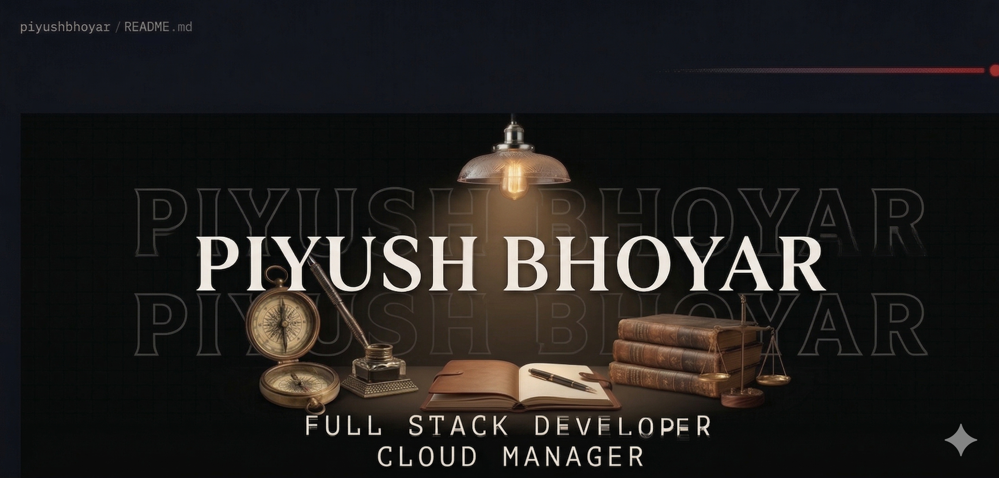

<!-- 🔁 Replace the src below with your own banner image path or URL -->

# Hello there,

<h1>💫 About Me:</h1>

<table>
  <tr>
    <td style="width:70%; vertical-align: top;">

- 💻 **Backend Developer & Cloud Intern** @ Parkby
- ⚡ Currently working with **Django, Supabase & AWS**
- 🧠 Solving **LeetCode challenges** daily
- 📚 **Skills:** React.js, Node.js, Express, MongoDB, AWS EC2/S3
- 🎓 B.Tech @ RTMNU Nagpur | Expected 2027
- 📬 **Email:** piyushbhoyar708@gmail.com

✨ *Building solutions that make a difference!* 🚀

    </td>
    <td style="width:30%; text-align:center;">
      <!-- 🔁 Replace with your own photo URL or local path -->
      
    </td>
  </tr>
</table>

## 🌐 Socials:

# 💻 Tech Stack:
             

# 📊 GitHub Stats:
 
 

# 🧠 LeetCode Stats:

> **310 Solved** &nbsp;|&nbsp; 🟢 Easy: 137 &nbsp;|&nbsp; 🟡 Medium: 161 &nbsp;|&nbsp; 🔴 Hard: 12
>
> Contest Rating: **1,487** &nbsp;|&nbsp; Top **48.21%** Globally &nbsp;|&nbsp; **17 Contests** &nbsp;|&nbsp; Max Streak: **44 days** 🔥

# 📈 3D Contribution Graph:

# 🐍 Snake Game:

<picture>
  <source media="(prefers-color-scheme: dark)" srcset="https://raw.githubusercontent.com/piyushwebs/piyushwebs/output/github-snake-dark.svg" />
  <source media="(prefers-color-scheme: light)" srcset="https://raw.githubusercontent.com/piyushwebs/piyushwebs/output/github-snake.svg" />
  
</picture>

### ✍️ Random Dev Quote

---

<!-- FOOTER -->

  

